----------
Smart Home
----------
In the last month I finally had some spare to scratch the surface on the latest of web backend and frontend development. In particular I got my fingers wet with nodejs and javascript. Back from where I originally come we love the saying `join useful and pleasant` and so I went and built a very custom and cheap **smart home system**. A system that guards our flat, watches over the fridge content and lets us control the lights through a convenience of a cell phone. Sounds cool? Lets take a tour then.

-------------
Home Security
-------------
You type in the web address of our home server (RaspberryPI) and you are offered the following selection:

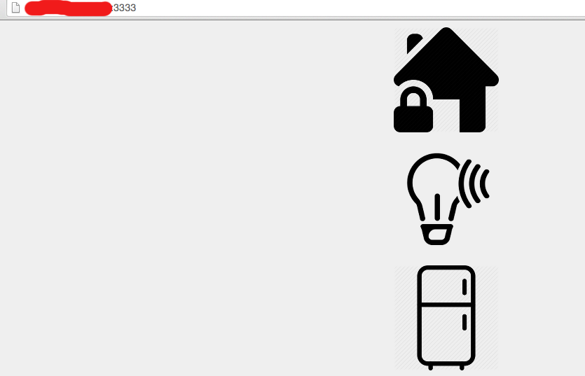

Lets get to know our security guard (PI, PI camera and PIR motion sensor).

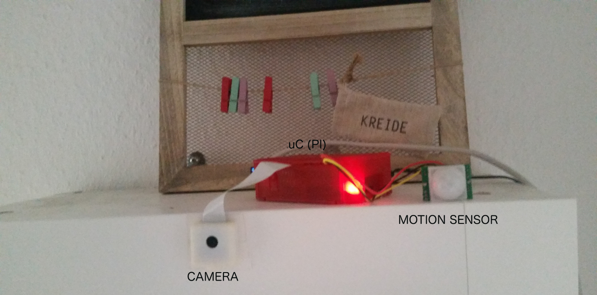

Interface offers live view into the appartment, switch to arm/disarm an alarm and link to the recorded snapshots whenever the alarm got triggered. The motion sensor senses a change of temperature as soon as someone enters through the door.

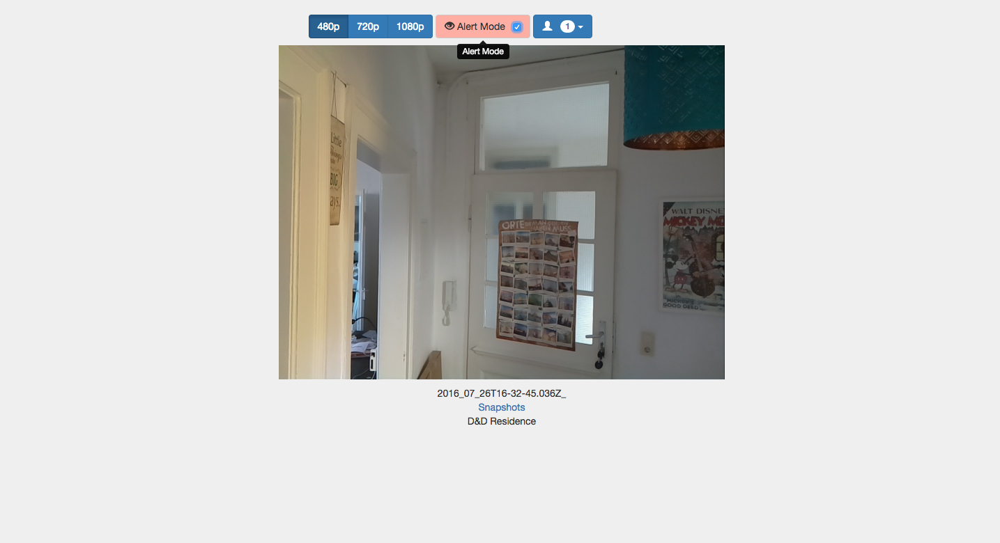

It also sends emails

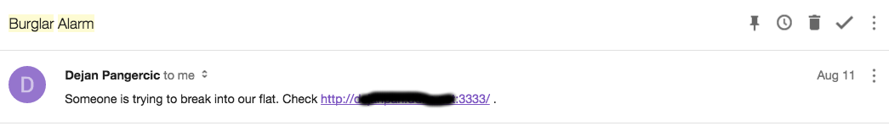

and comes with the gallery to watch burglars whenever you are bored

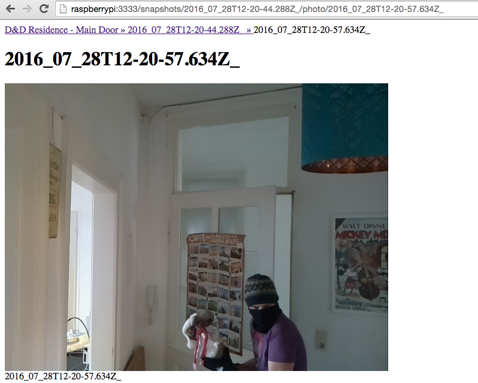

---------------------
What is in my Fridge
---------------------

Do you know this feeling when you stand in the supermarket and scratch your head trying to remember if you have milk in your fridge? Smart home to the rescue and no more scratching! Lets go back to the landing page:

Click on fridge icon and ... you will end up in our fridge gallery:

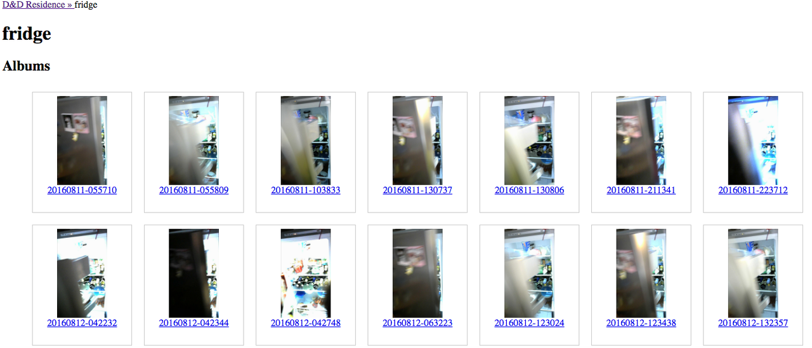

So is milk there? Nope! Remember I am watching this from the supermarket:)

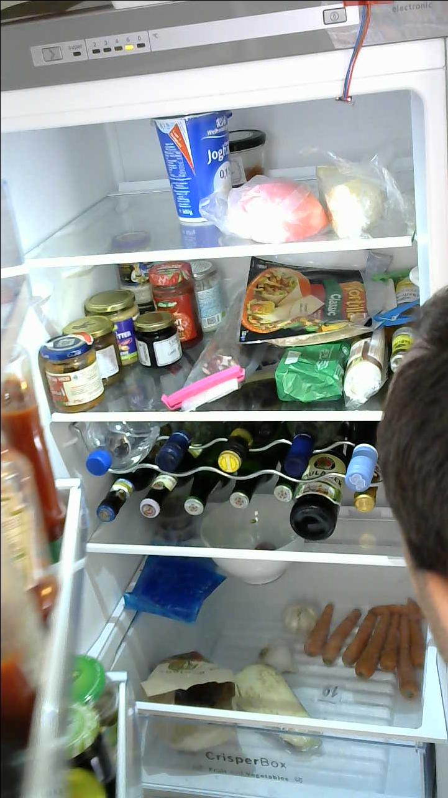

How does it work? Assuming you have a fridge, you order a PI:

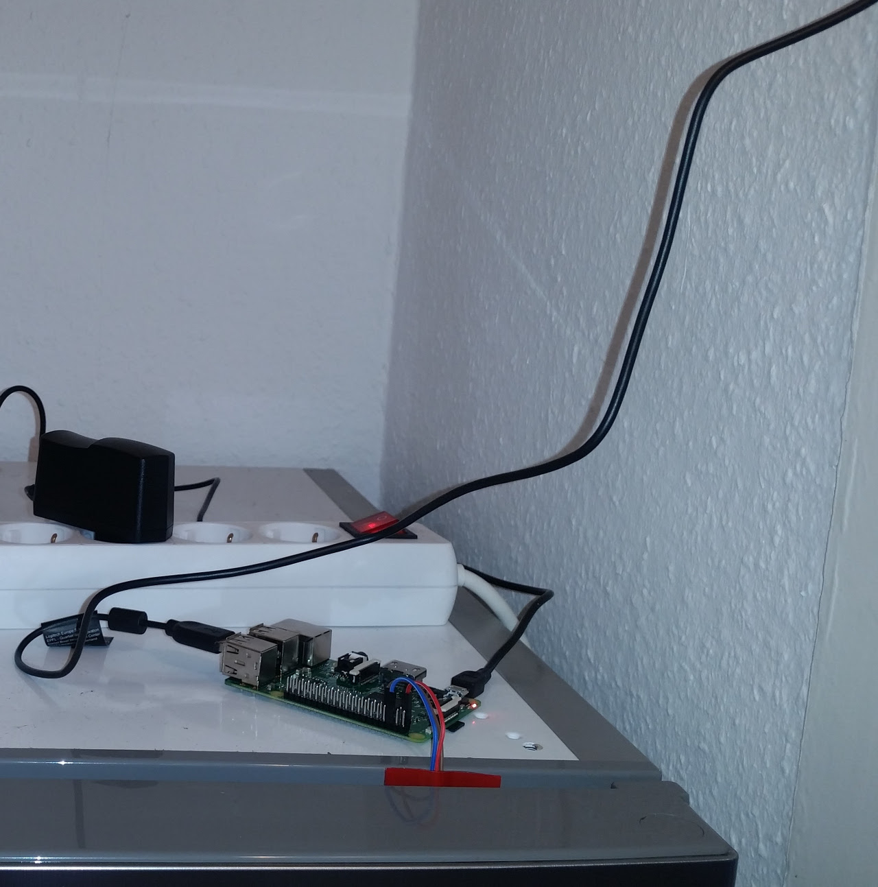

a web cam

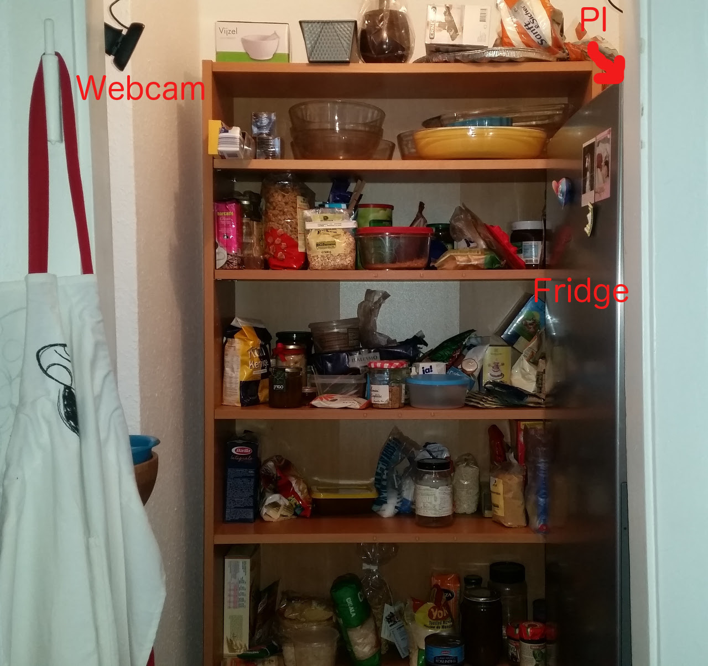

a light sensor and voila here you go. Every time you open the fridge, the light inside is turned on and this event triggers recording of fridge images until the fridge is closed again (and thus the light turned off).

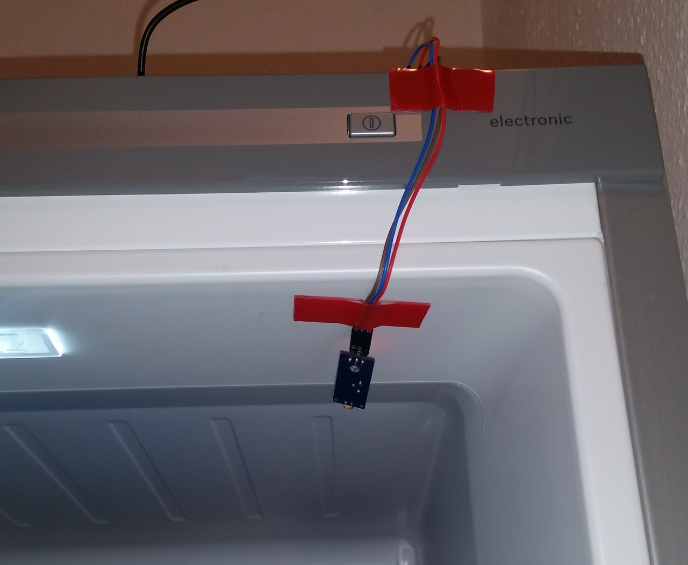

-------------------
Remote Light Switch
-------------------
How about that feeling when you are wrapped in the blanket in your bed and the light is still turned on? Worry not, we have a solution for this too. Back to landing page 

and after clicking on the bulb icon you can turn off the light from your cell phone.

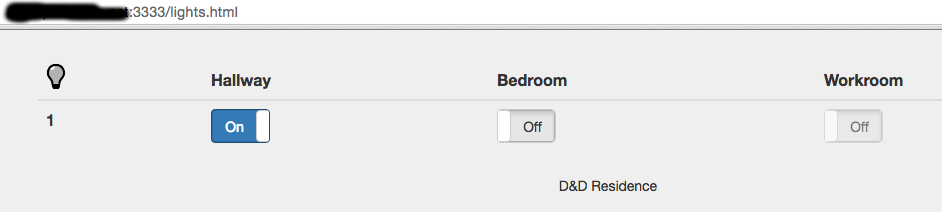

.. Now it is bright:
	
  .. image:: TODO
   :align: center
   :width: 800px

.. and now it is dark:

  .. image:: TODO
   :align: center
   :width: 800px

Remote light switch ensemble:

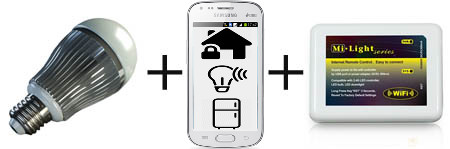

For technical implementation and details see: `documentation <documentation.rst>`_.